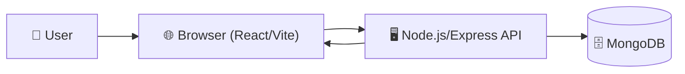
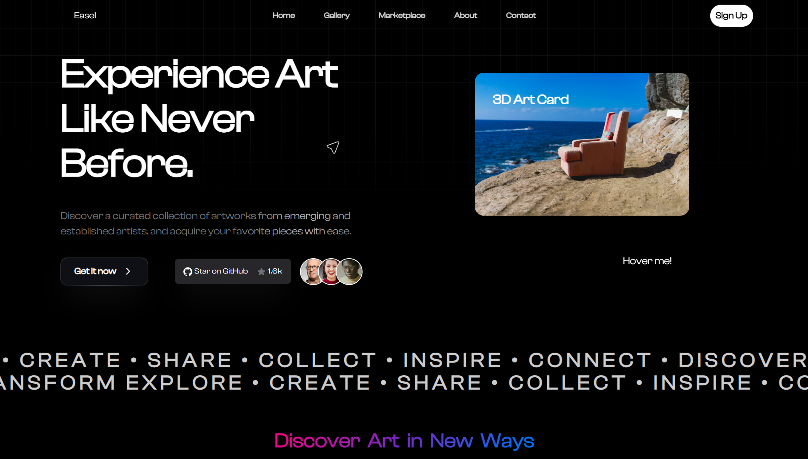
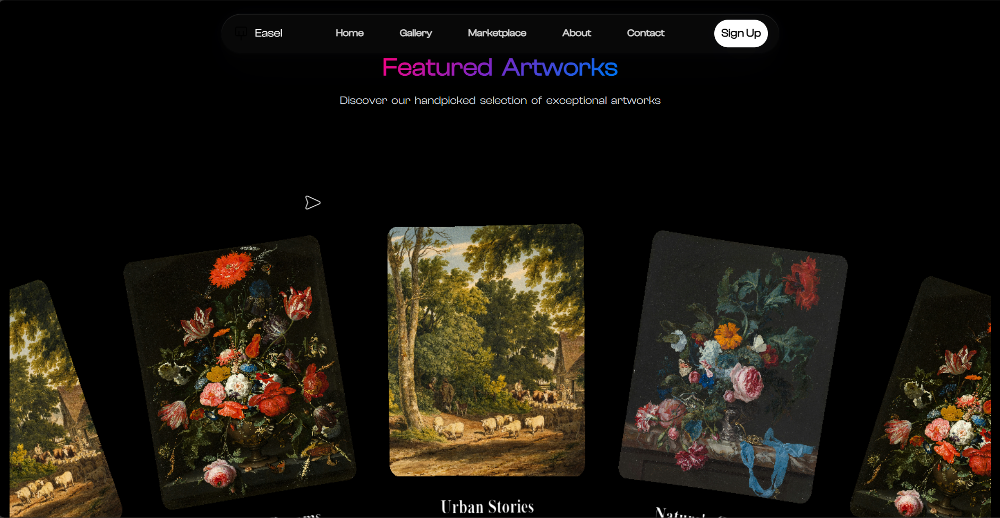
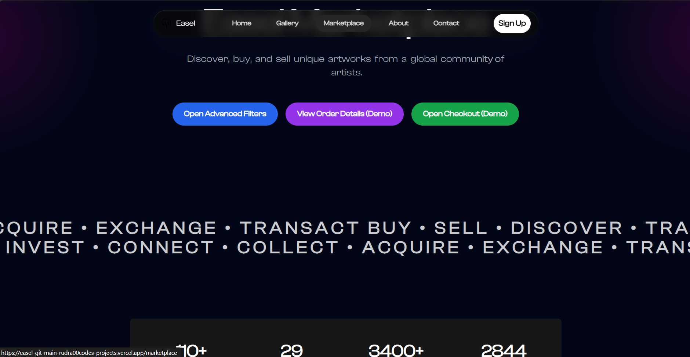
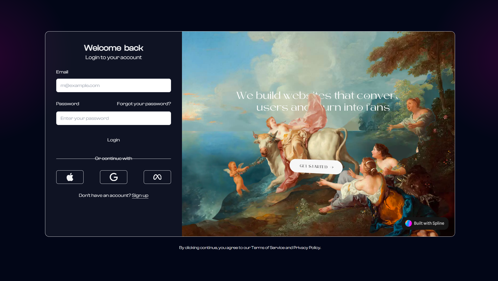
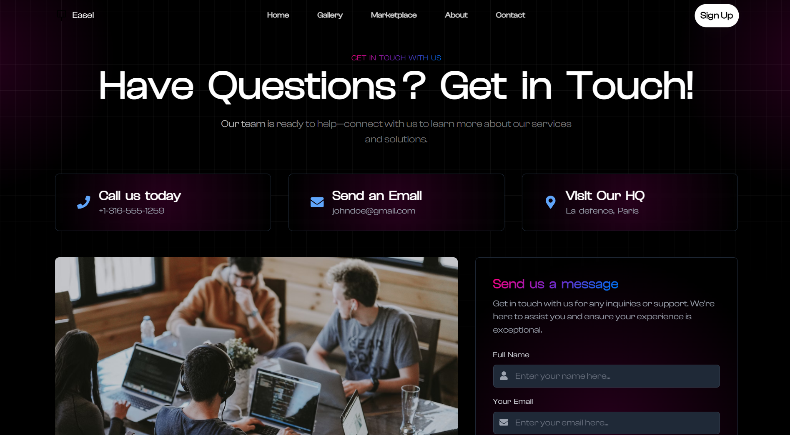
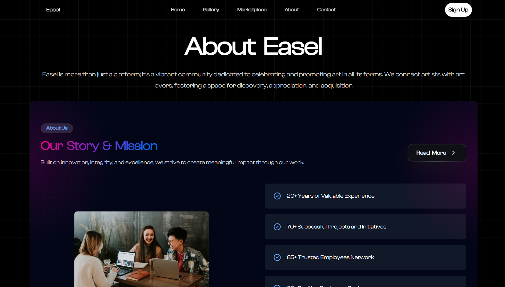

<p align="center">
  
</p>

# 🎨 Easel

A modern art gallery and marketplace web app built with React, Vite, and Tailwind CSS.

[](https://easel-delta.vercel.app)

---

## 📋 Table of Contents
- [🗺️ System Architecture](#system-architecture)
- [✨ Features](#features)
- [🖼️ Screenshots](#screenshots)
- [🚀 Getting Started](#getting-started)
- [🌐 Deployment](#deployment)
- [🛠️ Tech Stack](#tech-stack)
- [🙏 Acknowledgements](#acknowledgements)
- [📄 License](#license)

---

## 🗺️ System Architecture



---

## ✨ Features

- 🖼️ Browse and search the art gallery
- 🔐 User authentication (register/login)
- 📱 Responsive, modern UI
- 🛒 Marketplace for buying art
- 📊 Admin dashboard for artwork management
- ⚡ Fast performance with Vite
- ...and more!

---

## 🖼️ Screenshots

<details>
  <summary>🖼️ Click to expand Screenshots</summary>

  
  
  
  
  
  

</details>

---

## 🚀 Getting Started

```sh
git clone https://github.com/Rudra00codes/Easel.git
cd /client
npm install
npm run dev
```

> For backend setup, see `server/README.md` (if available).

---

## 🌐 Deployment

- Deployed on [Vercel](https://vercel.com/)
- See [deploy/vercel-deployment.md](deploy/vercel-deployment.md) for details
- **Live Demo:** [easel-delta.vercel.app](https://easel-delta.vercel.app)

---

## 🛠️ Tech Stack

- ⚛️ React
- ⚡ Vite
- 🎨 Tailwind CSS
- 🗃️ Redux Toolkit
- 🖼️ Framer Motion
- 🛒 Axios
- 🖥️ Node.js/Express (backend)
- 🗄️ MongoDB (backend)

---

## 🙏 Acknowledgements

- [Clash Display Font](https://www.fontshare.com/fonts/clash-display)
- [Radix UI](https://www.radix-ui.com/)
- [Vercel](https://vercel.com/)
- [React Router](https://reactrouter.com/)
- [Framer Motion](https://www.framer.com/motion/)
- [Redux Toolkit](https://redux-toolkit.js.org/)
- ...and all open-source contributors!

---

## 📄 License

MIT
